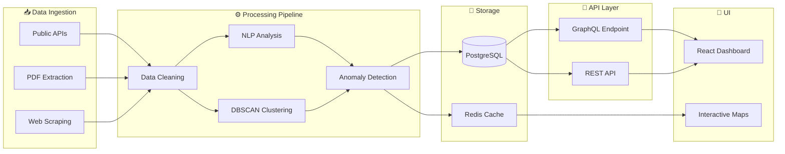

[](https://git.io/typing-svg)

---

## ⚠️ Status: Pre-Alpha — Active Development

**Version:** `0.1.0-alpha` · **Last updated:** March 14, 2026

CIVWATCH is a civic transparency platform that turns fragmented public records into legible, queryable feeds. It ingests agendas, minutes, budgets, contracts, and votes — normalizing them into anomaly-aware timelines so residents, journalists, and analysts can track how decisions are made, not just download PDFs.

This README reflects **actual current state** — not aspirations.

### Quick Links
- 📊 [Live Status Matrix](./STATUS.md) — per-component truth table
- 🛣️ [Implementation Roadmap](./IMPLEMENTATION_ROADMAP.md) — phased plan with issue links
- 📋 [Architecture Docs](./docs/architecture.md)
- 🔒 [Security Policy](./SECURITY.md) · [Responsible Disclosure](./RESPONSIBLE_DISCLOSURE.md)
- 🐛 [Issues](https://github.com/POWDER-RANGER/CIVWATCH/issues)

---

## 🎯 What Actually Works Right Now

| Component | Status | Details |
|-----------|--------|---------|
| **Backend — Status API** | ✅ Live | `GET /api/status` → `{status:'ok'}` on `:3000` |
| **Backend — Health API** | ✅ Live | `GET /api/health` → uptime + version info on `:3000` |
| **Backend — Anomaly Route** | ⚠️ Stub | `GET /api/anomalies` → empty array |
| **Backend — Ingest Route** | ⚠️ Stub | `POST /api/ingest` → 202 accepted, no processing |
| **ML Service (FastAPI)** | ✅ Live | FastAPI server on `:5000`, CORS enabled |
| **ML — Health Endpoint** | ✅ Live | `GET /health` → `{status:'ok'}` |
| **ML — DBSCAN Clustering** | ✅ Done | `POST /detect` fully functional via scikit-learn |
| **ML — Data Normalization** | ✅ Done | StandardScaler applied before every clustering pass |
| **Analytics Module** | ✅ Partial | `src/analytics/dataAnalyzer.ts` — mean, median, stddev |
| **Frontend Bootstrap** | ✅ Renders | Static header + React scaffolding at `:4000` |
| **Docker Compose** | ⚠️ Partial | Services start; healthcheck endpoints partially misaligned |
| **CI/CD Pipeline** | ⚠️ Stub | GitHub Actions defined — runs only `echo` statements, no real tests |
| **Unit Tests** | ⚠️ Stub | 1 test file, 1 placeholder `expect(true).toBe(true)` — 0% real coverage |
| **Dashboard UI** | ❌ Not started | React shell only; zero real components |
| **PostgreSQL** | ❌ Not wired | Env-var placeholder in compose only |
| **Redis** | ❌ Not wired | Env-var placeholder in compose only |
| **GraphQL Resolvers** | ❌ Not started | Schema defined; no resolvers implemented |
| **NLP Preprocessing** | ❌ Not started | Text pipeline not implemented |
| **WebSocket / Real-Time** | ❌ Not started | Streaming layer not built |
| **Authentication** | ❌ Not started | All API routes fully open |
| **Rate Limiting** | ❌ Not started | No middleware |

---

## 🗺️ Architecture Vision



### Repo Layout

```
backend/    Node.js/Express API (status ✅, health ✅, anomaly stub ⚠️)
frontend/   React scaffold (static shell only)
ml/         Python FastAPI — DBSCAN /detect live ✅
src/        Analytics module (mean/median/stddev — partial)
tests/      1 stub test file — real tests needed (#15)
docs/       Architecture, API spec, testing strategy
infra/      CI/CD config
.github/    GitHub Actions workflows (stub)
```

---

## 🚀 Get Started — Realistic Expectations

### Prerequisites
- Docker & Docker Compose
- Node.js 20+
- Python 3.10+

### Bring the Stack Up
```bash
git clone https://github.com/POWDER-RANGER/CIVWATCH.git
cd CIVWATCH
docker-compose up
```

### What You'll See Today
```
✅ Backend → http://localhost:3000
   GET /api/status  → {"status": "ok"}
   GET /api/health  → uptime + version info

✅ ML service → http://localhost:5000
   GET /health      → {"status": "ok"}
   POST /detect     → real DBSCAN anomaly detection results

✅ Frontend → http://localhost:4000
   Static header + React scaffold

⚠️  Docker healthchecks: partially misaligned — fix in #14
❌  Database: env-var stubs only, not wired
❌  Dashboard UI: not built
❌  CI: runs echo only, no actual test suite
```

### Local Development
```bash
# Backend
cd backend && npm install && npm run dev

# Frontend
cd frontend && npm install && npm run dev

# ML Service (runs today)
cd ml && pip install -r requirements.txt && python main.py
```

---

## 📊 Tech Stack


---

## 🛣️ Roadmap

### Phase 1: Foundation — In Progress
- [x] Backend `/api/health` endpoint live
- [x] ML FastAPI server live on `:5000`
- [x] DBSCAN `/detect` endpoint functional
- [x] Docker healthcheck for backend aligned
- [ ] Fix remaining Docker Compose healthcheck mismatches ([#14](https://github.com/POWDER-RANGER/CIVWATCH/issues/14), [#2](https://github.com/POWDER-RANGER/CIVWATCH/issues/2))
- [ ] Wire PostgreSQL connection ([#5](https://github.com/POWDER-RANGER/CIVWATCH/issues/5))
- [ ] Wire Redis client ([#5](https://github.com/POWDER-RANGER/CIVWATCH/issues/5))
- [ ] Replace test stubs with 5+ real assertions ([#15](https://github.com/POWDER-RANGER/CIVWATCH/issues/15))
- [ ] Fix type mismatches in `dataAnalyzer.ts` ([#3](https://github.com/POWDER-RANGER/CIVWATCH/issues/3))
- [ ] Basic React dashboard skeleton ([#10](https://github.com/POWDER-RANGER/CIVWATCH/issues/10))

### Phase 2: ML Core & API — Planned
- [ ] GraphQL schema + resolvers ([#6](https://github.com/POWDER-RANGER/CIVWATCH/issues/6))
- [ ] NLP preprocessing pipeline ([#8](https://github.com/POWDER-RANGER/CIVWATCH/issues/8))
- [ ] React dashboard: charts, anomaly table ([#10](https://github.com/POWDER-RANGER/CIVWATCH/issues/10), [#11](https://github.com/POWDER-RANGER/CIVWATCH/issues/11))
- [ ] WebSocket real-time updates ([#12](https://github.com/POWDER-RANGER/CIVWATCH/issues/12))
- [ ] Data ingestion pipeline
- [ ] Integration tests ([#15](https://github.com/POWDER-RANGER/CIVWATCH/issues/15))
- [ ] Authentication middleware ([#7](https://github.com/POWDER-RANGER/CIVWATCH/issues/7))
- [ ] Rate limiting ([#7](https://github.com/POWDER-RANGER/CIVWATCH/issues/7))

### Phase 3: Production Hardening — Future
- [ ] Security audit + penetration testing ([#17](https://github.com/POWDER-RANGER/CIVWATCH/issues/17))
- [ ] Performance optimization — caching strategy, query tuning
- [ ] CI/CD pipeline with real test execution ([#2](https://github.com/POWDER-RANGER/CIVWATCH/issues/2))
- [ ] 80%+ code coverage ([#16](https://github.com/POWDER-RANGER/CIVWATCH/issues/16))
- [ ] Packaged releases (Windows `.exe`, macOS `.dmg`, Linux `.AppImage`)
- [ ] Public read-only demo instance

---

## 🧪 Testing

**Current state: 1 test file · 1 stub assert · 0% real coverage.**

This is a top Phase 1 priority. Tracked in [#15](https://github.com/POWDER-RANGER/CIVWATCH/issues/15).

```bash
# Run current (stub) tests
npm test

# Python ML tests
pytest tests/ -v
```

See [docs/testing.md](./docs/testing.md) for planned testing strategy.

---

## 🤝 Contributing

Good first tasks — each has an open issue:

1. **Write real unit tests** for analytics and ML service ([#15](https://github.com/POWDER-RANGER/CIVWATCH/issues/15))
2. **Wire PostgreSQL** connection wrapper ([#5](https://github.com/POWDER-RANGER/CIVWATCH/issues/5))
3. **Fix Docker Compose** healthcheck alignment ([#14](https://github.com/POWDER-RANGER/CIVWATCH/issues/14))
4. **Build React components** — status card, anomaly table ([#10](https://github.com/POWDER-RANGER/CIVWATCH/issues/10))

See [CONTRIBUTING.md](./CONTRIBUTING.md). Keep PRs small and focused. Every PR needs a short *why* in the description.

---

## 🔒 Security

Do **not** open public issues for vulnerabilities. Use [GitHub Security Advisories](https://github.com/POWDER-RANGER/CIVWATCH/security/advisories).

Full policy: [SECURITY.md](./SECURITY.md) · [RESPONSIBLE_DISCLOSURE.md](./RESPONSIBLE_DISCLOSURE.md)

---

## 📄 License

MIT — see [LICENSE](./LICENSE).

---

## 📚 Docs Index

| File | Purpose |
|------|---------|
| [STATUS.md](./STATUS.md) | Live per-component implementation matrix |
| [IMPLEMENTATION_ROADMAP.md](./IMPLEMENTATION_ROADMAP.md) | Phased roadmap with PR plan and issue links |
| [NEXT_PHASE.md](./NEXT_PHASE.md) | Concrete this-week tasks and debugging guide |
| [SETUP.md](./SETUP.md) | Detailed local environment setup |
| [CHANGELOG.md](./CHANGELOG.md) | Version history |
| [GIT-CRYPT-SETUP.md](./GIT-CRYPT-SETUP.md) | Encrypted secrets via git-crypt |
| [SECURITY.md](./SECURITY.md) | Security practices |
| [RESPONSIBLE_DISCLOSURE.md](./RESPONSIBLE_DISCLOSURE.md) | Vulnerability reporting |
| [CREDIBILITY_CHECKLIST.md](./CREDIBILITY_CHECKLIST.md) | Repo health checklist |

---

**Built by Curtis Farrar** · Independent Systems Engineer & AI Security Architect  
[POWDER-RANGER on GitHub](https://github.com/POWDER-RANGER)
