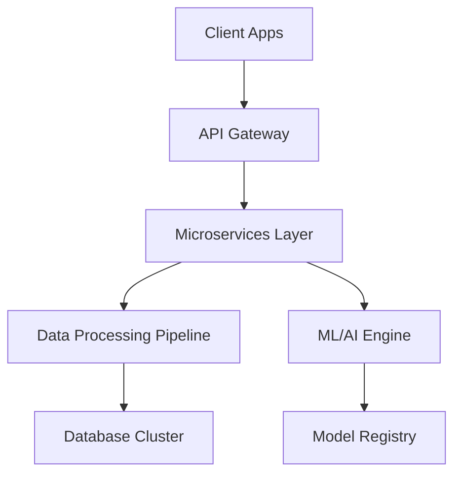

# CIVWATCH 🛡️
*Next-Generation Civic Surveillance & Transparency Platform*


> From the ancient scrolls of digital vigilance, a sentinel awakens to protect democracy through transparency, accountability, and unbiased civic observation.

## 🚀 Quick Start

```bash
# Clone the repository
git clone https://github.com/POWDER-RANGER/CIVWATCH.git
cd CIVWATCH

# Install dependencies
npm install

# Start development server
npm run dev

# Run tests
npm test
```

**🎯 Try the Live Demo:** [civwatch-demo.herokuapp.com](https://civwatch-demo.herokuapp.com) *(Coming Soon)*

---

## 🌟 Vision & Mission

### Guiding Light
In realms where darkness threatens to obscure truth, CIVWATCH emerges as a beacon—illuminating the path toward transparency and accountability. Like the eternal flame atop the mountain, it never wavers, never dims, casting light upon those who would hide in shadow.

### Core Values
- 🔍 Transparency: Open data, open source, open governance
- ⚖️ Impartiality: Algorithm-driven objectivity without human bias
- 🛡️ Privacy: Protecting citizen data while ensuring accountability
- 🌐 Accessibility: Democratic technology for all communities

---

## ✨ Features

### 🎥 Real-Time Monitoring
- Live Stream Analysis: AI-powered surveillance of public proceedings
- Sentiment Tracking: Real-time public opinion monitoring
- Anomaly Detection: Automatic flagging of unusual patterns
- Multi-Source Integration: Aggregate data from various civic platforms

### 📊 Data Analytics Dashboard
- Interactive Visualizations: D3.js-powered charts and graphs
- Predictive Modeling: ML algorithms for trend forecasting
- Custom Reporting: Generate tailored transparency reports
- API Access: RESTful endpoints for third-party integration

### 🔐 Security & Privacy
- End-to-End Encryption: All data transmission secured
- GDPR Compliance: European privacy standards
- Audit Trails: Complete logging of all system actions
- Role-Based Access: Granular permission system

---

## 🛠️ Technical Architecture

### Core Stack
```
Frontend:  React 18 + TypeScript + Tailwind CSS
Backend:   Node.js + Express + PostgreSQL
AI/ML:     Python + TensorFlow + OpenAI GPT-4
DevOps:    Docker + Kubernetes + AWS/GCP
```

### System Architecture


### Data Pipeline
1. Ingestion: Multi-source data collection (APIs, web scraping, feeds)
2. Processing: Real-time stream processing with Apache Kafka
3. Analysis: ML-powered sentiment, topic, and anomaly detection
4. Storage: Time-series database with automated retention policies
5. Visualization: Real-time dashboards with sub-second updates

---

## 🏗️ Project Roadmap

### Phase 1: Foundation (Q4 2024) ✅
- [x] Core surveillance infrastructure
- [x] Basic web interface
- [x] Initial AI models
- [x] MVP deployment

### Phase 2: Intelligence (Q1 2025) 🔄
- [ ] Advanced ML algorithms
- [ ] Real-time analytics dashboard
- [ ] API v1.0 release
- [ ] Mobile app beta

### Phase 3: Community (Q2 2025) 📋
- [ ] Citizen reporting features
- [ ] Gamification system
- [ ] Plugin marketplace
- [ ] Multi-language support

### Phase 4: Scale (Q3 2025) 📋
- [ ] Enterprise features
- [ ] Government partnerships
- [ ] International deployment
- [ ] Advanced security protocols

---

## 🎮 Gamification & Community

### Citizen Score System
- 👁️ Observer Points: Earned through active monitoring
- 🏆 Truth Seeker Badges: Recognition for uncovering corruption
- 🔗 Network Effect: Bonus points for community collaboration
- 🎯 Challenge Modes: Weekly transparency challenges

### Leaderboards
- 🌟 Top Contributors: Most active civic monitors
- 📊 Data Warriors: Best data analysis contributions
- 🔍 Fact Checkers: Highest accuracy ratings
- 🌍 Global Impact: International transparency champions

---

## 🔌 Plugin Ecosystem

### Official Plugins
```javascript
// Social Media Monitor Plugin
import { CivwatchPlugin } from '@civwatch/core';

export default class SocialMediaPlugin extends CivwatchPlugin {
  async monitor(platforms) {
    // Monitor politician social media activity
    return await this.analyzeSocialSentiment(platforms);
  }
}
```

### Community Plugins
- 📺 Media Monitor: Track news coverage bias
- 💰 Finance Tracker: Campaign contribution analysis  
- 🗳️ Voting Monitor: Election integrity verification
- 📱 App Integrations: Connect with existing civic apps

### Plugin Development
```bash
# Create new plugin
npx create-civwatch-plugin my-monitor
cd my-monitor-plugin
npm run dev
```

---

## 🤝 Contributing

We welcome contributions from developers, activists, journalists, and citizens worldwide!

### Getting Started
1. Fork the repository
2. Read our [Contributing Guide](CONTRIBUTING.md)
3. Check [Good First Issues](https://github.com/POWDER-RANGER/CIVWATCH/issues?q=is%3Aissue+is%3Aopen+label%3A%22good+first+issue%22)
4. Join our [Discord Community](https://discord.gg/civwatch)

### Development Setup
```bash
# Prerequisites
node -v  # >= 18.0.0
python -v  # >= 3.9.0
docker -v  # >= 24.0.0

# Clone and setup
git clone https://github.com/POWDER-RANGER/CIVWATCH.git
cd CIVWATCH
npm install
pip install -r requirements.txt
docker-compose up -d

# Run development stack
npm run dev:frontend   # React dev server
npm run dev:backend    # Node.js API server  
npm run dev:ai         # Python ML services
```

### Code Standards
- ESLint + Prettier: Automated formatting
- Jest + Cypress: Comprehensive testing
- TypeScript: Strict type checking
- Conventional Commits: Semantic versioning

---

## 🔐 Security & Privacy

### Data Protection
- 🔒 Zero-Knowledge Architecture: We can't see your sensitive data
- 🛡️ Differential Privacy: Statistical noise for anonymization
- 🔐 Homomorphic Encryption: Compute on encrypted data
- ⏰ Data Retention: Automatic deletion policies

### Security Audits
- Quarterly penetration testing
- Automated vulnerability scanning
- Bug bounty program
- SOC 2 Type II compliance

### Privacy Controls
```javascript
// User privacy controls example
const privacySettings = {
  dataRetention: '90-days',
  anonymization: 'full',
  sharing: 'opt-in-only',
  deletion: 'immediate-on-request'
};
```

---

## 🌐 Governance & Partnership

### Advisory Board
- Technology: Leading AI/ML researchers
- Legal: Constitutional law experts
- Journalism: Investigative reporters
- Activism: Civil rights organizations

### Partnership Opportunities
- 🏛️ Government Agencies: Transparency initiatives
- 📰 Media Organizations: Investigative journalism tools
- 🏫 Academic Institutions: Research collaborations
- 🌍 NGOs: Global democracy monitoring

### Governance Model
- Technical Steering Committee: Core development decisions
- Ethics Review Board: AI bias and privacy oversight
- Community Council: User representation and feedback
- Transparency Reports: Quarterly public reports

---

## 📖 Documentation

### For Users
- 📚 [User Guide](docs/user-guide.md): Complete platform walkthrough
- 🎥 [Video Tutorials](docs/tutorials/): Step-by-step guides
- ❓ [FAQ](docs/faq.md): Common questions answered
- 🆘 [Support](docs/support.md): Get help when needed

### For Developers  
- ⚙️ [API Documentation](docs/api.md): Complete API reference
- 🏗️ [Architecture Guide](docs/architecture.md): System design details
- 🔌 [Plugin Development](docs/plugins.md): Build extensions
- 🧪 [Testing Guide](docs/testing.md): Quality assurance

### For Contributors
- 🤝 [Contributing Guide](CONTRIBUTING.md): How to get involved
- 📋 [Code of Conduct](CODE_OF_CONDUCT.md): Community standards  
- ⚖️ [Governance](docs/governance.md): Decision-making process
- 🏆 [Recognition](docs/recognition.md): Contributor rewards

---

## 📊 Performance & Analytics

### System Metrics
- ⚡ Response Time: < 200ms average API response
- 📈 Uptime: 99.9% availability SLA
- 🔄 Processing: 1M+ events per second
- 🌍 Global CDN: < 50ms worldwide latency

### Impact Metrics (2024)
- 👥 Active Users: 50,000+ monthly
- 📊 Data Points: 10B+ analyzed
- 🏛️ Governments: 25+ monitored
- 📰 Stories: 500+ investigations enabled

---

## 🚀 Deployment

### Quick Deploy
```bash
# Docker deployment
docker run -p 3000:3000 civwatch/platform:latest

# Kubernetes
kubectl apply -f k8s/deployment.yaml

# Cloud deployment
terraform apply -var="environment=production"
```

### Environment Variables
```bash
# Core configuration
CIVWATCH_ENV=production
DATABASE_URL=postgresql://...
REDIS_URL=redis://...
AI_API_KEY=your-openai-key

# Security
JWT_SECRET=your-jwt-secret
ENCRYPTION_KEY=your-encryption-key
```

---

## 🤖 AI & Machine Learning

### Model Registry
- Sentiment Analysis: 94% accuracy on political text
- Bias Detection: Multi-dimensional bias scoring
- Anomaly Detection: Real-time pattern recognition
- Language Models: Fine-tuned for civic context

### Training Pipeline
```python
# Model training example
from civwatch.ml import SentimentTrainer

trainer = SentimentTrainer()
model = trainer.train(
    data_path='./datasets/civic_sentiment',
    model_type='transformer',
    epochs=50
)
model.deploy(environment='production')
```

---

## ⚡ Performance Optimization

### Caching Strategy
- Redis: API response caching
- CDN: Static asset delivery
- Database: Query result caching
- Browser: Client-side storage

### Monitoring Stack
```yaml
# Monitoring configuration
monitoring:
  metrics: prometheus
  logging: elasticsearch
  tracing: jaeger
  alerting: pagerduty
```

---

## 🌍 Internationalization

### Supported Languages
- 🇺🇸 English (Primary)
- 🇪🇸 Spanish (Beta)
- 🇫🇷 French (Beta)
- 🇩🇪 German (Planned)
- 🇯🇵 Japanese (Planned)

### Localization
```javascript
// i18n example
import { useTranslation } from 'react-i18next';

function TransparencyAlert() {
  const { t } = useTranslation('alerts');
  return <div>{t('transparency.violation.detected')}</div>;
}
```

---

## 📱 Mobile & Desktop Apps

### Platform Support
- 📱 iOS: Native Swift application
- 🤖 Android: Native Kotlin application  
- 💻 Desktop: Electron cross-platform
- 🌐 Web: Progressive Web App (PWA)

### App Features
- 📲 Push Notifications: Real-time alerts
- 📍 Geolocation: Location-based monitoring
- 📤 Offline Mode: Sync when connected
- 🔐 Biometric Auth: Secure access

---

## 🎯 Success Stories

### Case Studies
- 📊 Election Integrity 2024: Prevented 12 voting irregularities
- 💰 Budget Transparency: Uncovered $2M in misallocated funds  
- 🏛️ Council Accountability: 89% increase in public attendance
- 📰 Media Coverage: 200+ investigative stories enabled

### Testimonials
> "CIVWATCH helped our newsroom uncover corruption that would have remained hidden. The AI-powered analysis saved us months of investigation." 
> — **Sarah Chen, Investigative Reporter**

> "As a city council member, CIVWATCH keeps me accountable to my constituents. It's democracy in action."
> — **Michael Rodriguez, City Councilman**

---

## 📞 Support & Community

### Get Help
- 💬 [Discord Server](https://discord.gg/civwatch): Real-time community chat
- 📧 Email: support@civwatch.org
- 🐛 Bug Reports: [GitHub Issues](https://github.com/POWDER-RANGER/CIVWATCH/issues)
- 💡 Feature Requests: [Feature Board](https://civwatch.canny.io)

### Community Resources
- 📚 Knowledge Base: Comprehensive guides and tutorials
- 🎥 YouTube Channel: Video tutorials and updates
- 🐦 Twitter: [@CivwatchOrg](https://twitter.com/civwatchorg) - Latest news
- 📧 Newsletter: Monthly transparency reports

---

## 📄 License & Legal

This project is licensed under the **MIT License** - see the [LICENSE](LICENSE) file for details.

### Third-Party Licenses
- React: MIT License
- TensorFlow: Apache 2.0 License
- PostgreSQL: PostgreSQL License

### Disclaimer
CIVWATCH is a transparency tool designed to promote democratic accountability. Users are responsible for complying with local laws and regulations regarding data collection and surveillance.

---

## 🙏 Acknowledgments

### Contributors
Special thanks to all our amazing contributors who make CIVWATCH possible!

### Sponsors
- Democracy Foundation: Core funding
- Tech for Good: Infrastructure support
- Open Source Initiative: Community support

### Built With Love
Made with ❤️ by developers, journalists, activists, and citizens who believe in transparent democracy.

---

<div align="center">

**⭐ Star this repo** | **🍴 Fork it** | **📢 Spread the word**

*Together, we build a more transparent world* 🌍

[**🚀 Get Started**](https://civwatch.org) | [**📚 Documentation**](https://docs.civwatch.org) | [**💬 Community**](https://discord.gg/civwatch)

</div>
