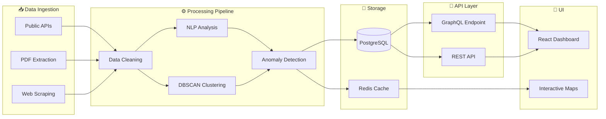

[](https://git.io/typing-svg)

---

## ⚠️ Status: Pre-Alpha (Planning Phase)

**CIVWATCH is in active development.** Docs describe intended architecture; core implementation is scaffolded. This repo is honest about what works and what's planned.

### Quick Links
- 📋 [Architecture Docs](./docs/architecture.md) — Intended design
- 🧪 [Testing Strategy](./docs/testing.md) — How we'll validate
- 🔒 [Security Policy](./SECURITY.md) — Responsible disclosure
- 🐛 [Issues & Roadmap](https://github.com/POWDER-RANGER/CIVWATCH/issues) — What's next

---

## 🎯 What Actually Works Right Now

| Component | Status | Details |
|-----------|--------|---------|
| **Backend Status API** | ✅ Live | `GET /api/status` → `{status: 'ok'}` on `:3000` |
| **Frontend Bootstrap** | ✅ Renders | Static header + React scaffolding at `:4000` |
| **Analytics Module** | ✅ Partial | `src/analytics/dataAnalyzer.ts` — mean, median, stddev calculations |
| **Test Stubs** | ✅ Present | `tests/analytics/` — ready for real test implementation |
| **Docker Compose** | ⚠️ Partial | Services start; healthchecks need endpoint alignment |
| **ML Service** | ❌ Stub | Currently placeholder; DBSCAN + NLP planned |
| **Dashboard UI** | ❌ Stub | React shell exists; no real components yet |
| **DB/Redis Integration** | ❌ Not Wired | PostgreSQL + Redis placeholders in compose |
| **Real-Time Updates** | ❌ Planned | WebSocket layer not built |

---

## 🗺️ Architecture Vision



---

## 🚀 Get Started (Realistic Expectations)

### Prerequisites
- Docker & Docker Compose
- Node.js 18+ (for local dev)
- Python 3.10+ (for ML service)

### Start the Stack
```bash
git clone https://github.com/POWDER-RANGER/CIVWATCH.git
cd CIVWATCH
docker-compose up
```

### What You'll See
```
✅ Backend running on http://localhost:3000
   - GET /api/status → {"status": "ok"}
   - Other endpoints: planned

✅ Frontend on http://localhost:4000
   - Static header rendering
   - React scaffolding ready for dashboard

⚠️  ML service: placeholder (HTTP server not running yet)

❌ Database connections: stub environment variables only
```

### Local Development
```bash
# Backend
cd backend && npm install && npm run dev

# Frontend
cd frontend && npm install && npm run dev

# ML Service (when ready)
cd ml && pip install -r requirements.txt && python main.py
```

---

## 📊 Tech Stack


---

## 🛣️ Roadmap

### Phase 1: Foundation (In Progress)
- [ ] Align Docker healthcheck endpoints
- [ ] Implement real `/api/health` endpoint
- [ ] Fix type mismatches in `dataAnalyzer.ts`
- [ ] Write actual test cases (replace stubs)
- [ ] Wire PostgreSQL connection
- [ ] Wire Redis client

**Issues:** [#2](https://github.com/POWDER-RANGER/CIVWATCH/issues/2), [#3](https://github.com/POWDER-RANGER/CIVWATCH/issues/3)

### Phase 2: ML Core (Planned)
- [ ] Implement DBSCAN clustering in ML service
- [ ] Add NLP preprocessing pipeline
- [ ] Create GraphQL schema and resolvers
- [ ] Build real React dashboard components
- [ ] Integrate WebSocket for real-time updates

**Issues:** [#4](https://github.com/POWDER-RANGER/CIVWATCH/issues/4), [#5](https://github.com/POWDER-RANGER/CIVWATCH/issues/5)

### Phase 3: Production Hardening (Future)
- [ ] Security audit and penetration testing
- [ ] Performance optimization (caching strategies)
- [ ] Comprehensive test coverage (target: 80%+)
- [ ] CI/CD pipeline automation
- [ ] Packaged releases (Windows exe, macOS dmg, Linux AppImage)

---

## 🧪 Testing

Test structure exists but is scaffolded:
```bash
# Run (stub) tests
npm test

# Python tests (when ML service is ready)
pytest tests/ -v
```

See [docs/testing.md](./docs/testing.md) for testing strategy.

---

## 🤝 Contributing

We're actively building CIVWATCH! See [CONTRIBUTING.md](./CONTRIBUTING.md) for guidelines.

### Best Places to Jump In
1. **Finish Phase 1** — Help implement real tests and database wiring
2. **Fix docs** — Break a link? Open an issue
3. **Code review** — PRs always welcome

---

## 🔒 Security

Found a vulnerability? Please follow our [Responsible Disclosure](./RESPONSIBLE_DISCLOSURE.md) process instead of opening a public issue.

See [SECURITY.md](./SECURITY.md) for security practices and contact.

---

## 📄 License

MIT License — see [LICENSE](./LICENSE) for details.

---

## 📚 Learn More

- **[Architecture Docs](./docs/architecture.md)** — System design, data flow, component breakdown
- **[API Spec](./docs/api.md)** — Planned REST + GraphQL endpoints
- **[Setup Guide](./SETUP.md)** — Detailed environment setup
- **[Changelog](./CHANGELOG.md)** — Version history and release notes

---

## 💬 Questions?

Open an [issue](https://github.com/POWDER-RANGER/CIVWATCH/issues) or check existing discussions.

---

**Built by Curtis Farrar** | Independent Systems Engineer & AI Security Architect  
[GitHub](https://github.com/POWDER-RANGER) · [Portfolio](mailto:contact@example.com)
