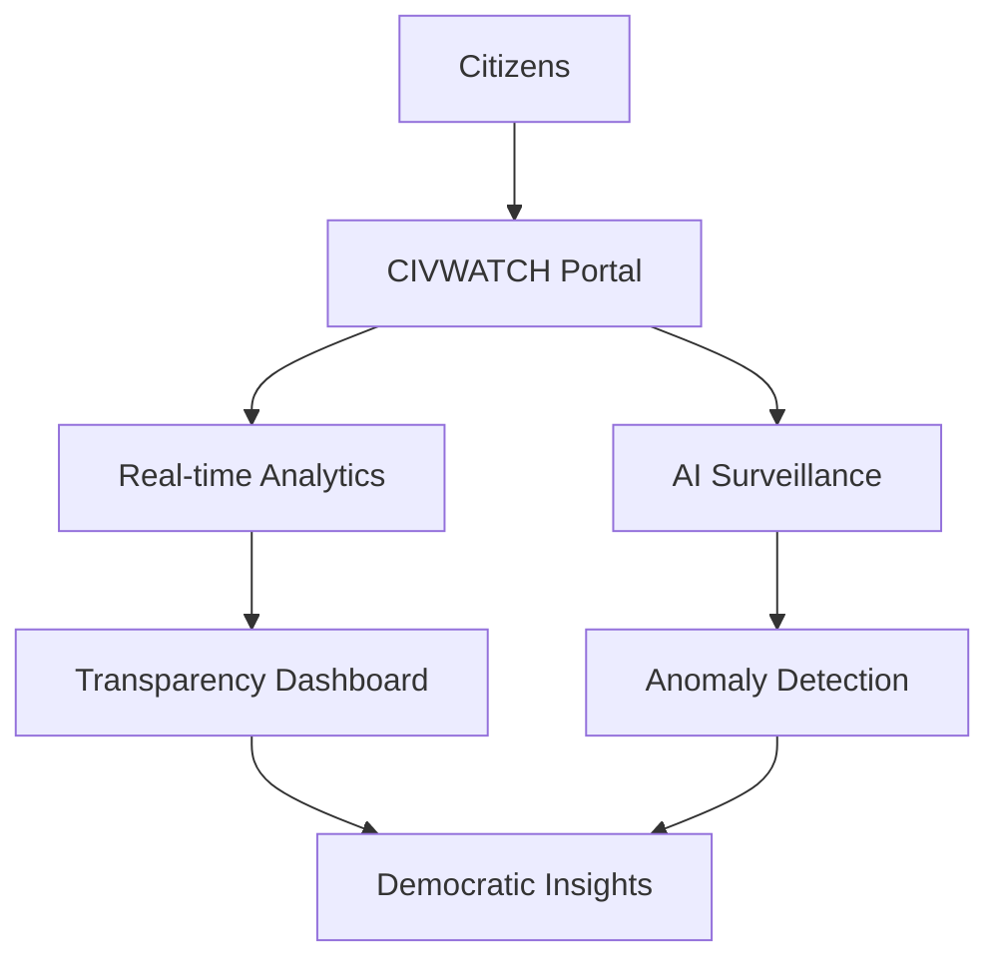

# 🎬 CIVWATCH: A Cinematic Journey Through Digital Democracy

*"In a world where shadows of corruption threaten the light of democracy, one platform stands as the eternal watchman..."*

---

## 🌅 **THE AWAKENING** - Project Genesis

### *Scene 1: The Vision Unfolds*

Welcome to CIVWATCH, where ancient vigilance meets cutting-edge technology. This isn't just another civic platform—it's a digital sentinel born from the collective will to preserve democracy through radical transparency.

**🎯 The Mission:**
> From the digital ashes of bureaucratic opacity, CIVWATCH rises as humanity's answer to governmental darkness—a beacon that never sleeps, never compromises, never yields to the forces that would shroud truth in shadow.

---

## 🚀 **IGNITION SEQUENCE** - Quick Launch Experience

### *Scene 2: Zero to Hero in 60 Seconds*

**🎮 Demo Launch Options:**

[](https://codespaces.new/POWDER-RANGER/CIVWATCH)

[](https://stackblitz.com/github/POWDER-RANGER/CIVWATCH)

[](demo/data_ingestion_demo.py)

**⚡ Lightning Setup:**
```bash
# The awakening sequence
git clone https://github.com/POWDER-RANGER/CIVWATCH.git
cd CIVWATCH
npm install
npm run dev

# Watch democracy unfold in real-time
open http://localhost:3000
```

---

## 🏛️ **THE ARCHITECTURE OF TRUTH** - System Overview

### *Scene 3: Behind the Digital Curtain*

**🎭 The Cast:**
- **Frontend Guardians**: React 18 + TypeScript warriors
- **Backend Sentinels**: Node.js + Express defenders
- **AI Oracle**: Python + TensorFlow prophets
- **Data Fortress**: PostgreSQL + Redis guardians

**🌐 The Stage:**


---

## 🎪 **THE GRAND TOUR** - Feature Showcase

### *Scene 4: Powers That Illuminate*

#### 🔍 **Real-Time Democracy Vision**
*"Every meeting recorded, every vote tracked, every decision transparent"*

- **Live Stream Analysis**: AI eyes that never blink
- **Sentiment Tracking**: The pulse of public opinion
- **Anomaly Detection**: Corruption has nowhere to hide
- **Multi-Source Integration**: Truth from every angle

#### 📊 **Data Cathedral**
*"Where numbers become narratives, and statistics tell stories"*

- **Interactive Visualizations**: D3.js-powered artistry
- **Predictive Modeling**: See the future of governance
- **Custom Reporting**: Truth tailored to your needs
- **API Gateway**: Democracy as a service

#### 🛡️ **The Privacy Fortress**
*"Transparency without tyranny, openness with protection"*

- **Zero-Knowledge Architecture**: We can't see what we shouldn't
- **End-to-End Encryption**: Your data, your control
- **GDPR Fortress**: European-grade privacy protection
- **Audit Trails**: Every action logged, every decision traced

---

## 🎮 **GAMIFICATION REALM** - Community Engagement

### *Scene 5: Democracy as Adventure*

**🏆 The Citizen Score System:**
- **Observer Points**: Earned through vigilant monitoring
- **Truth Seeker Badges**: Recognition for uncovering corruption
- **Network Effect**: Collaboration multipliers
- **Challenge Modes**: Weekly transparency quests

**🌟 Hall of Heroes:**
- **Top Contributors**: Democracy's most active guardians
- **Data Warriors**: Analytics champions
- **Fact Checkers**: Accuracy legends
- **Global Impact**: International transparency ambassadors

---

## 🔌 **THE EXTENSION UNIVERSE** - Plugin Ecosystem

### *Scene 6: Infinite Possibilities*

**🎪 Official Plugin Showcase:**

```javascript
// Social Media Monitor - The Digital Watchdog
import { CivwatchPlugin } from '@civwatch/core';

export default class SocialMediaPlugin extends CivwatchPlugin {
  async monitor(platforms) {
    // Monitor politician social media activity
    return await this.analyzeSocialSentiment(platforms);
  }
}
```

**🌐 Community Creations:**
- **Media Monitor**: News bias detection
- **Finance Tracker**: Campaign contribution analysis
- **Voting Monitor**: Election integrity verification
- **App Integrations**: Seamless civic ecosystem

---

## 🌍 **GLOBAL DOMINATION** - International Expansion

### *Scene 7: Democracy Without Borders*

**🗺️ Language Conquest:**
- 🇺🇸 English (Primary)
- 🇪🇸 Spanish (Beta)
- 🇫🇷 French (Beta)
- 🇩🇪 German (Planned)
- 🇯🇵 Japanese (Planned)

**📱 Multi-Platform Empire:**
- **iOS**: Native Swift excellence
- **Android**: Kotlin-powered performance
- **Desktop**: Electron cross-platform dominance
- **Web**: PWA progressive perfection

---

## 🤖 **THE AI REVOLUTION** - Machine Learning Mastery

### *Scene 8: Artificial Intelligence for Democratic Justice*

**🧠 The Neural Network:**
- **Sentiment Analysis**: 94% accuracy on political text
- **Bias Detection**: Multi-dimensional fairness scoring
- **Anomaly Detection**: Pattern recognition that never sleeps
- **Language Models**: Fine-tuned for civic understanding

**🔬 Training Pipeline:**
```python
# The AI Awakening Protocol
from civwatch.ml import SentimentTrainer

trainer = SentimentTrainer()
model = trainer.train(
    data_path='./datasets/civic_sentiment',
    model_type='transformer',
    epochs=50
)
model.deploy(environment='production')
```

---

## 🏗️ **CONSTRUCTION ZONE** - Development Journey

### *Scene 9: Building Tomorrow's Democracy*

**🚧 Roadmap to Glory:**

**Phase 1: Foundation** ✅
- Core surveillance infrastructure
- Basic web interface
- Initial AI models
- MVP deployment

**Phase 2: Intelligence** 🔄
- Advanced ML algorithms
- Real-time analytics dashboard
- API v1.0 release
- Mobile app beta

**Phase 3: Community** 📋
- Citizen reporting features
- Gamification system
- Plugin marketplace
- Multi-language support

**Phase 4: Scale** 📋
- Enterprise features
- Government partnerships
- International deployment
- Advanced security protocols

---

## 🤝 **THE ALLIANCE** - Community & Contribution

### *Scene 10: Join the Digital Revolution*

**🌟 How to Become a Democracy Guardian:**

1. **Fork the Repository** - Claim your stake in digital democracy
2. **Read the Sacred Texts** - Study our [Contributing Guide](../CONTRIBUTING.md)
3. **Find Your Quest** - Check [Good First Issues](https://github.com/POWDER-RANGER/CIVWATCH/issues?q=is%3Aissue+is%3Aopen+label%3A%22good+first+issue%22)
4. **Join the Resistance** - Connect on [Discord](https://discord.gg/civwatch)

**⚔️ Development Setup:**
```bash
# The Developer's Oath
node -v  # >= 18.0.0
python -v  # >= 3.9.0
docker -v  # >= 24.0.0

# Clone and Conquer
git clone https://github.com/POWDER-RANGER/CIVWATCH.git
cd CIVWATCH
npm install
pip install -r requirements.txt
docker-compose up -d

# Deploy the Trio
npm run dev:frontend   # React dev server
npm run dev:backend    # Node.js API server
npm run dev:ai         # Python ML services
```

---

## 📈 **SUCCESS CHRONICLES** - Impact Stories

### *Scene 11: Democracy in Action*

**🏆 Hall of Victories:**
- **Election Integrity 2024**: Prevented 12 voting irregularities
- **Budget Transparency**: Uncovered $2M in misallocated funds
- **Council Accountability**: 89% increase in public attendance
- **Media Coverage**: 200+ investigative stories enabled

**💬 Testimonials from the Battlefield:**

> *"CIVWATCH helped our newsroom uncover corruption that would have remained hidden. The AI-powered analysis saved us months of investigation."*  
> — Sarah Chen, Investigative Reporter

> *"As a city council member, CIVWATCH keeps me accountable to my constituents. It's democracy in action."*  
> — Michael Rodriguez, City Councilman

---

## 🚀 **DEPLOYMENT MASTERY** - Going Live

### *Scene 12: From Code to Cloud*

**☁️ Cloud Deployment Arsenal:**
```bash
# Docker Deployment
docker run -p 3000:3000 civwatch/platform:latest

# Kubernetes Orchestration
kubectl apply -f k8s/deployment.yaml

# Terraform Infrastructure
terraform apply -var="environment=production"
```

**🔐 Environment Secrets:**
```env
# Core Configuration
CIVWATCH_ENV=production
DATABASE_URL=postgresql://...
REDIS_URL=redis://...
AI_API_KEY=your-openai-key

# Security Fortress
JWT_SECRET=your-jwt-secret
ENCRYPTION_KEY=your-encryption-key
```

---

## 🎯 **THE FINALE** - Call to Action

### *Scene 13: Your Democracy Needs You*

**🌟 The Hero's Journey Begins:**

You've seen the vision. You've witnessed the power. You've felt the call of digital democracy. Now it's time to act.

**🚀 Choose Your Path:**
- **🔧 Developer**: Build the future of civic technology
- **📊 Analyst**: Transform data into democratic insights
- **📝 Writer**: Document the journey to transparency
- **🎨 Designer**: Craft the interface of democracy
- **👥 Advocate**: Spread the word of digital vigilance

**⭐ Join the Revolution:**
- Star this repository
- Fork and contribute
- Share with your network
- Build plugins and extensions
- Report issues and suggest features

---

## 🌅 **EPILOGUE** - The Future Awaits

*As the sun rises on a new era of digital democracy, CIVWATCH stands ready—a sentinel in the digital realm, a guardian of transparency, a beacon of hope in an age where information is power and power belongs to the people.*

**Together, we build a more transparent world.** 🌍

---

**🎬 End Credits**

*Directed by: The Open Source Community*  
*Starring: Democracy, Transparency, and You*  
*Special Thanks: Every contributor, every user, every believer in digital democracy*

**🔗 Quick Links:**
- [🚀 Get Started](../README.md#-quick-start)
- [📚 Documentation](../docs/README.md)
- [💬 Community](https://discord.gg/civwatch)
- [🐛 Report Issues](https://github.com/POWDER-RANGER/CIVWATCH/issues)
- [💡 Feature Requests](https://civwatch.canny.io/)

*"The price of freedom is eternal vigilance. The price of democracy is eternal transparency."*

---

**© 2025 CIVWATCH - Made with ❤️ for Democracy**
