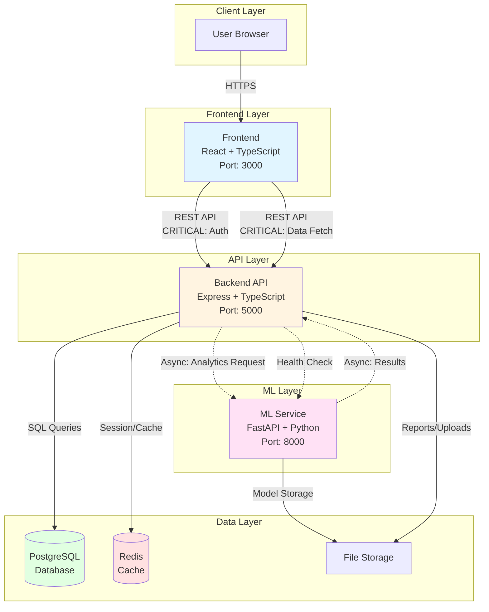

# CIVWATCH Architecture

## Overview

CIVWATCH is a three-tier civic transparency platform with a clear separation of concerns:

- **Frontend**: TypeScript/React application for user interaction
- **Backend**: REST API server handling business logic and data persistence
- **ML Service**: Python-based machine learning service for analytics and insights

All services communicate via well-defined REST APIs and are containerized for consistent deployment across environments.

## System Components

### Frontend (`frontend/`)
- **Technology**: React 18 + TypeScript + Tailwind CSS
- **Responsibility**: User interface, client-side routing, form validation
- **Port**: 3000 (development)
- **Build Output**: Static assets served via nginx in production

### Backend (`backend/`)
- **Technology**: Node.js + Express + TypeScript
- **Responsibility**: REST API, authentication, authorization, data persistence
- **Port**: 5000 (development)
- **Database**: PostgreSQL for structured data
- **Cache**: Redis for session management and rate limiting

### ML Service (`ml/`)
- **Technology**: Python + FastAPI + scikit-learn/TensorFlow
- **Responsibility**: Text analysis, sentiment detection, topic modeling, predictive analytics
- **Port**: 8000 (development)
- **Model Storage**: Serialized models in `/ml/models/`

## Data Flow Table

| Flow Name | Source | Destination | Type | Path Label | Description |
|-----------|--------|-------------|------|------------|-------------|
| User Authentication | Frontend | Backend | Sync | **CRITICAL** | Login/logout, JWT token generation |
| API Request | Frontend | Backend | Sync | Normal | Standard CRUD operations |
| Analytics Request | Backend | ML Service | Async | Normal | Text analysis, sentiment detection |
| Analytics Response | ML Service | Backend | Async | Normal | Processed analytics results |
| Data Fetch | Frontend | Backend | Sync | **CRITICAL** | Dashboard data, user data |
| Model Training | Backend | ML Service | Async | Batch | Scheduled model retraining |
| Alert Generation | Backend | Frontend | Async | **CRITICAL** | Real-time notifications via WebSocket |
| Health Check | Backend | ML Service | Sync | Normal | Service availability monitoring |

### Path Label Legend
- **CRITICAL**: User-blocking operations that directly impact UX
- **Normal**: Standard operations with typical latency tolerance
- **Batch**: Background operations with no immediate user impact
- **Async**: Non-blocking operations that return immediately
- **Sync**: Blocking operations that wait for response

## System Architecture Diagram



## Primary Data Flows

### 1. User Data Flow (CRITICAL PATH)
```
User → Frontend → Backend → PostgreSQL
                ↓
              Redis (session cache)
                ↓
            Response → Frontend → User
```

**Characteristics**: Synchronous, user-blocking, low-latency required (<200ms)

### 2. API Data Flow (NORMAL PATH)
```
Frontend → Backend API
              ↓
         Business Logic
              ↓
         PostgreSQL CRUD
              ↓
         JSON Response → Frontend
```

**Characteristics**: Synchronous, RESTful, typical latency (<500ms)

### 3. Analytics Data Flow (ASYNC PATH)
```
Backend → Queue Analytics Request
             ↓
        ML Service (async)
             ↓
        Process with ML models
             ↓
        Return results → Backend
             ↓
        Store in PostgreSQL
             ↓
        Notify Frontend (WebSocket/polling)
```

**Characteristics**: Asynchronous, non-blocking, variable latency (1-30s)

### 4. Authentication Flow (CRITICAL PATH)
```
Frontend → POST /api/auth/login
              ↓
         Backend validates credentials
              ↓
         Query PostgreSQL
              ↓
         Generate JWT token
              ↓
         Store session in Redis
              ↓
         Return token → Frontend
              ↓
         Store in localStorage
```

**Characteristics**: Synchronous, security-critical, must be atomic

## API Endpoints

### Frontend → Backend
- `GET /api/health` - Health check
- `POST /api/auth/login` - User authentication (CRITICAL)
- `POST /api/auth/logout` - User logout
- `GET /api/users/:id` - Fetch user data (CRITICAL)
- `GET /api/dashboard` - Dashboard data (CRITICAL)
- `POST /api/reports` - Submit report for analysis
- `GET /api/reports/:id` - Fetch report status
- `GET /api/analytics/:id` - Fetch analytics results

### Backend → ML Service
- `GET /health` - ML service health check
- `POST /analyze/sentiment` - Sentiment analysis (ASYNC)
- `POST /analyze/topics` - Topic extraction (ASYNC)
- `POST /analyze/entities` - Named entity recognition (ASYNC)
- `POST /train/model` - Trigger model training (BATCH)
- `GET /models/:id/metrics` - Fetch model performance

## Deployment Architecture

### Development (Docker Compose)
```yaml
services:
  frontend:  localhost:3000
  backend:   localhost:5000
  ml:        localhost:8000
  postgres:  localhost:5432
  redis:     localhost:6379
```

### Production (Kubernetes)
```
Ingress Controller (HTTPS)
    ↓
Frontend Service (nginx) → Frontend Pods
    ↓
Backend Service → Backend Pods → PostgreSQL RDS
    ↓                           → Redis ElastiCache
ML Service → ML Pods → S3 (model storage)
```

## Security Model

### Authentication
- JWT tokens with 1-hour expiration
- Refresh tokens stored in Redis (7-day TTL)
- Passwords hashed with bcrypt (cost factor: 12)

### Authorization
- Role-based access control (RBAC)
- Roles: `admin`, `analyst`, `viewer`
- Endpoint-level permission checks

### Network Security
- All inter-service communication over internal network
- TLS 1.3 for external connections
- Rate limiting: 100 requests/minute per IP
- CORS enabled only for whitelisted origins

## Performance Characteristics

### Critical Path Latency Targets
- Authentication: <200ms (p95)
- Dashboard load: <300ms (p95)
- API requests: <500ms (p95)

### Async Path Latency Targets
- Analytics (simple): <5s (p95)
- Analytics (complex): <30s (p95)
- Model training: <1 hour (batch)

### Throughput Targets
- API: 1,000 req/s (horizontal scaling)
- ML: 100 analysis req/s (queue-based)

## Observability

### Logging
- Structured JSON logs from all services
- Log levels: ERROR, WARN, INFO, DEBUG
- Centralized via ELK stack or CloudWatch

### Metrics
- Prometheus metrics exported from all services
- Key metrics:
  - Request rate, error rate, latency (p50, p95, p99)
  - Database connection pool usage
  - ML model inference time
  - Cache hit rate

### Tracing
- Distributed tracing via OpenTelemetry
- Trace requests across frontend → backend → ML
- Identify bottlenecks in critical paths

## Scalability Strategy

### Horizontal Scaling
- **Frontend**: Stateless, scale indefinitely behind load balancer
- **Backend**: Stateless (sessions in Redis), scale based on CPU/memory
- **ML Service**: Scale based on queue depth and inference time

### Vertical Scaling
- **PostgreSQL**: Scale up for write-heavy workloads
- **Redis**: Scale up for high-throughput caching

### Caching Strategy
- User sessions: Redis (1-hour TTL)
- Dashboard data: Redis (5-minute TTL)
- Analytics results: PostgreSQL (permanent) + Redis (1-hour TTL)

## Technology Stack Summary

| Layer | Technology | Language | Purpose |
|-------|------------|----------|----------|
| Frontend | React 18 | TypeScript | User interface |
| Backend API | Express | TypeScript | Business logic |
| ML Service | FastAPI | Python 3.11+ | Machine learning |
| Database | PostgreSQL 15+ | SQL | Data persistence |
| Cache | Redis 7+ | - | Session & caching |
| Container | Docker | - | Containerization |
| Orchestration | Docker Compose / K8s | - | Service coordination |

## Future Enhancements

1. **WebSocket Integration**: Real-time updates for dashboard
2. **GraphQL API**: Alternative to REST for flexible querying
3. **Event Streaming**: Kafka for high-volume event processing
4. **CDN Integration**: CloudFront for static asset delivery
5. **Multi-region Deployment**: Active-active for high availability

## References

- [API Documentation](./api.md)
- [Testing Strategy](./testing.md)
- [Deployment Guide](./tutorials/installation.md)
- [Contributing Guidelines](../CONTRIBUTING.md)
