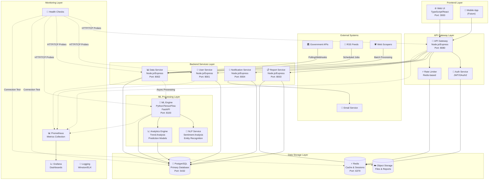
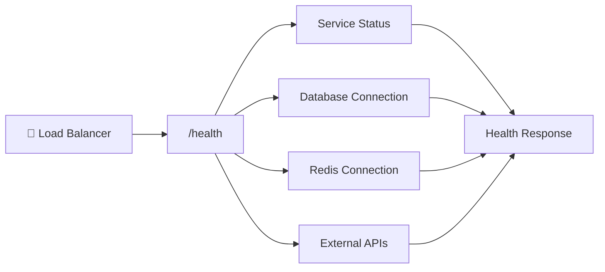
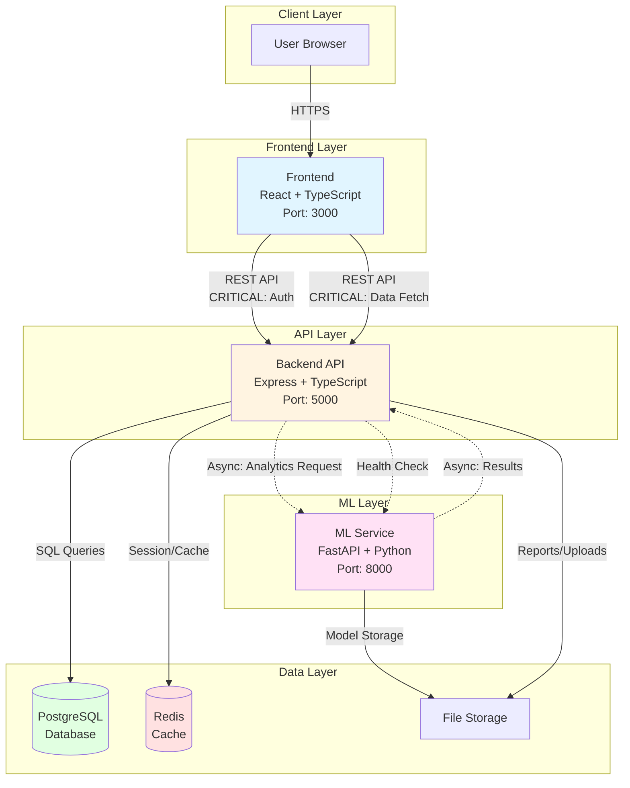

# CIVWATCH System Architecture

## Overview

CIVWATCH is a comprehensive civic transparency platform built with a modern microservices architecture. The system follows a layered approach with clear separation of concerns between presentation, business logic, data processing, and storage layers.

## System Architecture Diagram



## Component Details

### Frontend Layer (TypeScript/React)

**Technology Stack:**
- React 18 with TypeScript
- Material-UI or Tailwind CSS for styling
- React Query for data fetching and caching
- React Router for navigation
- Webpack/Vite for bundling

**Key Features:**
- Responsive web interface
- Real-time dashboards
- Interactive data visualizations
- User authentication flows
- Progressive Web App (PWA) capabilities

**Critical Paths:**
- User login/authentication flow
- Dashboard data loading
- Report generation requests
- Real-time notifications

### Backend Layer (Node.js/Express)

**API Gateway (Port 8080):**
- Request routing and load balancing
- Authentication and authorization
- Rate limiting and throttling
- Request/response transformation
- API versioning and documentation

**Core Services:**

1. **User Service (Port 8001):**
   - User registration and profile management
   - Role-based access control (RBAC)
   - User preferences and settings
   - Session management

2. **Data Service (Port 8002):**
   - Government data ingestion
   - Data validation and normalization
   - CRUD operations for civic data
   - Data export and filtering

3. **Report Service (Port 8003):**
   - Report template management
   - Dynamic report generation
   - Scheduled reporting
   - Export to various formats (PDF, CSV, JSON)

4. **Notification Service (Port 8004):**
   - Alert rules engine
   - Multi-channel notifications (email, SMS, push)
   - Notification preferences
   - Template management

### ML Processing Layer (Python/TensorFlow)

**ML Engine (Port 8100):**
- FastAPI-based service
- TensorFlow/PyTorch model serving
- Model versioning and A/B testing
- Batch and real-time inference

**Capabilities:**
- **NLP Services:**
  - Sentiment analysis of public comments
  - Named entity recognition
  - Topic modeling and classification
  - Text summarization

- **Analytics Engine:**
  - Trend analysis and forecasting
  - Anomaly detection
  - Predictive modeling
  - Statistical analysis

### Data Storage Layer

**PostgreSQL (Port 5432):**
- Primary relational database
- ACID compliance for critical data
- Full-text search capabilities
- JSON/JSONB support for flexible schemas
- Read replicas for scaling

**Redis (Port 6379):**
- Session storage
- Application caching
- Rate limiting counters
- Pub/sub for real-time features
- Queue management

**Object Storage:**
- Document and file storage
- Report archives
- ML model artifacts
- Static asset delivery

## Data Flow Architecture

### 1. Data Ingestion Flow
```
External Sources → Data Service → Validation → PostgreSQL
                ↓
            ML Engine → Analysis → Results Storage
```

### 2. User Request Flow
```
Frontend → API Gateway → Auth Check → Backend Service → Database
                      ↓                              ↓
                Rate Limit                      Cache Layer
```

### 3. Real-time Processing Flow
```
Data Updates → Event Queue → ML Processing → Analysis Results → Notifications
```

## Async Communication Patterns

### 1. Event-Driven Architecture
- Services communicate via events
- Decoupled processing pipelines
- Retry mechanisms and dead letter queues
- Event sourcing for audit trails

### 2. Message Queue Integration
- Redis pub/sub for real-time updates
- Background job processing
- Scheduled task execution
- Load balancing across service instances

### 3. Webhook Processing
- External API webhooks handling
- Asynchronous data processing
- Error handling and retry logic
- Rate limiting and throttling

## Health Check Flow

### Application Health Checks


**Health Check Endpoints:**
- `GET /health` - Basic service health
- `GET /health/ready` - Readiness probe
- `GET /health/live` - Liveness probe
- `GET /health/detailed` - Comprehensive status

## Critical Paths

### 1. User Authentication Path
```
Login Request → API Gateway → Auth Service → JWT Generation → Session Storage
             ↓
        Rate Limiting → User Validation → Database Query → Response
```

### 2. Data Processing Path
```
Data Ingestion → Validation → Storage → ML Processing → Analysis → Notification
```

### 3. Report Generation Path
```
Report Request → Authorization → Data Query → ML Analysis → Report Generation → Storage
```

## API Endpoint Summary

### Core API Endpoints

**Authentication:**
- `POST /api/auth/login` - User login
- `POST /api/auth/register` - User registration
- `POST /api/auth/refresh` - Token refresh
- `DELETE /api/auth/logout` - User logout

**User Management:**
- `GET /api/users/profile` - Get user profile
- `PUT /api/users/profile` - Update profile
- `GET /api/users/preferences` - Get preferences
- `PUT /api/users/preferences` - Update preferences

**Data Services:**
- `GET /api/data/civic` - Get civic data
- `POST /api/data/civic` - Submit civic data
- `GET /api/data/search` - Search data
- `GET /api/data/analytics` - Get analytics

**Reporting:**
- `GET /api/reports` - List reports
- `POST /api/reports` - Create report
- `GET /api/reports/{id}` - Get specific report
- `GET /api/reports/{id}/download` - Download report

**Notifications:**
- `GET /api/notifications` - Get notifications
- `POST /api/notifications/subscribe` - Subscribe to alerts
- `PUT /api/notifications/{id}/read` - Mark as read
- `DELETE /api/notifications/{id}` - Delete notification

**ML Services:**
- `POST /api/ml/analyze` - Analyze data
- `GET /api/ml/models` - List available models
- `POST /api/ml/predict` - Make predictions
- `GET /api/ml/insights` - Get insights

### Health and Monitoring:
- `GET /health` - Service health
- `GET /metrics` - Prometheus metrics
- `GET /api/status` - System status
- `GET /api/version` - Service version

## Security Architecture

### Authentication & Authorization
- JWT-based authentication
- Role-based access control (RBAC)
- OAuth2 integration for third-party auth
- API key management for external integrations

### Data Security
- End-to-end encryption for sensitive data
- Database encryption at rest
- Secure API communication (HTTPS/TLS)
- Input validation and sanitization

### Infrastructure Security
- Container security scanning
- Network segmentation
- Secrets management
- Regular security audits

## Deployment Architecture

### Development Environment
```bash
docker-compose up  # Starts all services locally
```

### Production Environment
- Container orchestration (Docker Swarm/Kubernetes)
- Load balancing and auto-scaling
- Blue-green deployments
- Database clustering and backups

### Monitoring and Observability
- Prometheus for metrics collection
- Grafana for visualization
- Structured logging with ELK stack
- Distributed tracing
- Alert management

## Performance Considerations

### Caching Strategy
- Redis for application-level caching
- CDN for static assets
- Database query optimization
- API response caching

### Scalability
- Horizontal scaling of stateless services
- Database read replicas
- Asynchronous processing
- Load balancing strategies

### Optimization
- Database indexing strategy
- Query optimization
- Connection pooling
- Batch processing for large datasets

---

*This architecture document is living and will be updated as the system evolves. For implementation details, see the respective service documentation in each workspace directory.*
=======
CIVWATCH is a three-tier civic transparency platform with a clear separation of concerns:

- **Frontend**: TypeScript/React application for user interaction
- **Backend**: REST API server handling business logic and data persistence
- **ML Service**: Python-based machine learning service for analytics and insights

All services communicate via well-defined REST APIs and are containerized for consistent deployment across environments.

## System Components

### Frontend (`frontend/`)
- **Technology**: React 18 + TypeScript + Tailwind CSS
- **Responsibility**: User interface, client-side routing, form validation
- **Port**: 3000 (development)
- **Build Output**: Static assets served via nginx in production

### Backend (`backend/`)
- **Technology**: Node.js + Express + TypeScript
- **Responsibility**: REST API, authentication, authorization, data persistence
- **Port**: 5000 (development)
- **Database**: PostgreSQL for structured data
- **Cache**: Redis for session management and rate limiting

### ML Service (`ml/`)
- **Technology**: Python + FastAPI + scikit-learn/TensorFlow
- **Responsibility**: Text analysis, sentiment detection, topic modeling, predictive analytics
- **Port**: 8000 (development)
- **Model Storage**: Serialized models in `/ml/models/`

## Data Flow Table

| Flow Name | Source | Destination | Type | Path Label | Description |
|-----------|--------|-------------|------|------------|-------------|
| User Authentication | Frontend | Backend | Sync | **CRITICAL** | Login/logout, JWT token generation |
| API Request | Frontend | Backend | Sync | Normal | Standard CRUD operations |
| Analytics Request | Backend | ML Service | Async | Normal | Text analysis, sentiment detection |
| Analytics Response | ML Service | Backend | Async | Normal | Processed analytics results |
| Data Fetch | Frontend | Backend | Sync | **CRITICAL** | Dashboard data, user data |
| Model Training | Backend | ML Service | Async | Batch | Scheduled model retraining |
| Alert Generation | Backend | Frontend | Async | **CRITICAL** | Real-time notifications via WebSocket |
| Health Check | Backend | ML Service | Sync | Normal | Service availability monitoring |

### Path Label Legend
- **CRITICAL**: User-blocking operations that directly impact UX
- **Normal**: Standard operations with typical latency tolerance
- **Batch**: Background operations with no immediate user impact
- **Async**: Non-blocking operations that return immediately
- **Sync**: Blocking operations that wait for response

## System Architecture Diagram



## Primary Data Flows

### 1. User Data Flow (CRITICAL PATH)
```
User → Frontend → Backend → PostgreSQL
                ↓
              Redis (session cache)
                ↓
            Response → Frontend → User
```

**Characteristics**: Synchronous, user-blocking, low-latency required (<200ms)

### 2. API Data Flow (NORMAL PATH)
```
Frontend → Backend API
              ↓
         Business Logic
              ↓
         PostgreSQL CRUD
              ↓
         JSON Response → Frontend
```

**Characteristics**: Synchronous, RESTful, typical latency (<500ms)

### 3. Analytics Data Flow (ASYNC PATH)
```
Backend → Queue Analytics Request
             ↓
        ML Service (async)
             ↓
        Process with ML models
             ↓
        Return results → Backend
             ↓
        Store in PostgreSQL
             ↓
        Notify Frontend (WebSocket/polling)
```

**Characteristics**: Asynchronous, non-blocking, variable latency (1-30s)

### 4. Authentication Flow (CRITICAL PATH)
```
Frontend → POST /api/auth/login
              ↓
         Backend validates credentials
              ↓
         Query PostgreSQL
              ↓
         Generate JWT token
              ↓
         Store session in Redis
              ↓
         Return token → Frontend
              ↓
         Store in localStorage
```

**Characteristics**: Synchronous, security-critical, must be atomic

## API Endpoints

### Frontend → Backend
- `GET /api/health` - Health check
- `POST /api/auth/login` - User authentication (CRITICAL)
- `POST /api/auth/logout` - User logout
- `GET /api/users/:id` - Fetch user data (CRITICAL)
- `GET /api/dashboard` - Dashboard data (CRITICAL)
- `POST /api/reports` - Submit report for analysis
- `GET /api/reports/:id` - Fetch report status
- `GET /api/analytics/:id` - Fetch analytics results

### Backend → ML Service
- `GET /health` - ML service health check
- `POST /analyze/sentiment` - Sentiment analysis (ASYNC)
- `POST /analyze/topics` - Topic extraction (ASYNC)
- `POST /analyze/entities` - Named entity recognition (ASYNC)
- `POST /train/model` - Trigger model training (BATCH)
- `GET /models/:id/metrics` - Fetch model performance

## Deployment Architecture

### Development (Docker Compose)
```yaml
services:
  frontend:  localhost:3000
  backend:   localhost:5000
  ml:        localhost:8000
  postgres:  localhost:5432
  redis:     localhost:6379
```

### Production (Kubernetes)
```
Ingress Controller (HTTPS)
    ↓
Frontend Service (nginx) → Frontend Pods
    ↓
Backend Service → Backend Pods → PostgreSQL RDS
    ↓                           → Redis ElastiCache
ML Service → ML Pods → S3 (model storage)
```

## Security Model

### Authentication
- JWT tokens with 1-hour expiration
- Refresh tokens stored in Redis (7-day TTL)
- Passwords hashed with bcrypt (cost factor: 12)

### Authorization
- Role-based access control (RBAC)
- Roles: `admin`, `analyst`, `viewer`
- Endpoint-level permission checks

### Network Security
- All inter-service communication over internal network
- TLS 1.3 for external connections
- Rate limiting: 100 requests/minute per IP
- CORS enabled only for whitelisted origins

## Performance Characteristics

### Critical Path Latency Targets
- Authentication: <200ms (p95)
- Dashboard load: <300ms (p95)
- API requests: <500ms (p95)

### Async Path Latency Targets
- Analytics (simple): <5s (p95)
- Analytics (complex): <30s (p95)
- Model training: <1 hour (batch)

### Throughput Targets
- API: 1,000 req/s (horizontal scaling)
- ML: 100 analysis req/s (queue-based)

## Observability

### Logging
- Structured JSON logs from all services
- Log levels: ERROR, WARN, INFO, DEBUG
- Centralized via ELK stack or CloudWatch

### Metrics
- Prometheus metrics exported from all services
- Key metrics:
  - Request rate, error rate, latency (p50, p95, p99)
  - Database connection pool usage
  - ML model inference time
  - Cache hit rate

### Tracing
- Distributed tracing via OpenTelemetry
- Trace requests across frontend → backend → ML
- Identify bottlenecks in critical paths

## Scalability Strategy

### Horizontal Scaling
- **Frontend**: Stateless, scale indefinitely behind load balancer
- **Backend**: Stateless (sessions in Redis), scale based on CPU/memory
- **ML Service**: Scale based on queue depth and inference time

### Vertical Scaling
- **PostgreSQL**: Scale up for write-heavy workloads
- **Redis**: Scale up for high-throughput caching

### Caching Strategy
- User sessions: Redis (1-hour TTL)
- Dashboard data: Redis (5-minute TTL)
- Analytics results: PostgreSQL (permanent) + Redis (1-hour TTL)

## Technology Stack Summary

| Layer | Technology | Language | Purpose |
|-------|------------|----------|----------|
| Frontend | React 18 | TypeScript | User interface |
| Backend API | Express | TypeScript | Business logic |
| ML Service | FastAPI | Python 3.11+ | Machine learning |
| Database | PostgreSQL 15+ | SQL | Data persistence |
| Cache | Redis 7+ | - | Session & caching |
| Container | Docker | - | Containerization |
| Orchestration | Docker Compose / K8s | - | Service coordination |

## Future Enhancements

1. **WebSocket Integration**: Real-time updates for dashboard
2. **GraphQL API**: Alternative to REST for flexible querying
3. **Event Streaming**: Kafka for high-volume event processing
4. **CDN Integration**: CloudFront for static asset delivery
5. **Multi-region Deployment**: Active-active for high availability

## References

- [API Documentation](./api.md)
- [Testing Strategy](./testing.md)
- [Deployment Guide](./tutorials/installation.md)
- [Contributing Guidelines](../CONTRIBUTING.md)
